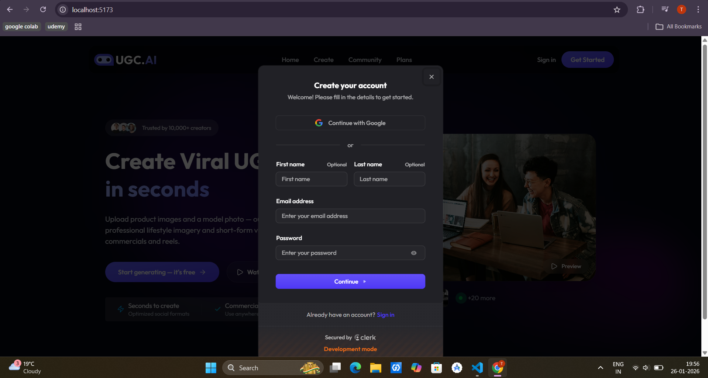
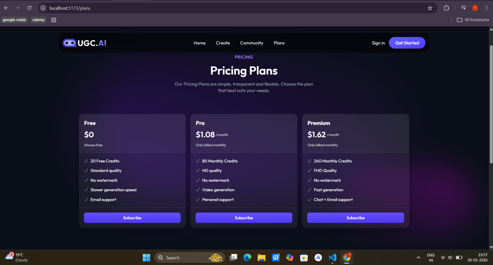

# 🎬 UGC AI — Create AI-Generated Video & Images

UGC AI is a modern, full-stack AI platform that allows users to generate high-quality **AI images and videos** for ads, marketing, and social media — all through a clean, production-ready UI.

Built with a SaaS mindset: **authentication, plans, credits, community sharing**, and scalable architecture.

---

## 🚀 Features

- 🤖 AI-powered Image & Video Generation
- 🔐 Secure Authentication (Sign In / Sign Up) using **Clerk**
- 🧾 Credit-based system (Free & Paid plans)
- 💳 Pricing Plans (Free, Pro, Premium)
- 🌍 Community page to showcase generations
- 🖼️ Generation Result page (view & download outputs)
- 🎨 Modern UI with Tailwind & React
- ⚡ Fast & responsive frontend

---

## 🔐 Authentication (Clerk)

Users can securely authenticate using:

- Google OAuth
- Email & Password

### Sign In

### Sign Up

Authentication is handled using **Clerk Authentication**, ensuring security, scalability, and easy session management.

---

## 🎨 AI Generation Flow

Users can:

1. Provide product details & prompts
2. Generate AI images or videos
3. View results on the **Generation Result page**
4. Download or share outputs

### Generation Result Page

---

## 💳 Pricing Plans & Credits

UGC AI follows a **credit-based model**.

### Available Plans

| Plan    | Price       | Credits | Features                         |
| ------- | ----------- | ------- | -------------------------------- |
| Free    | $0          | 20      | Standard quality, watermark-free |
| Pro     | $1.08/month | 80      | HD quality, video generation     |
| Premium | $1.62/month | 240     | FHD quality, fastest generation  |

Users can:

- Use **free credits**
- Upgrade to **paid plans**
- Generate content based on available credits

---

## 🛠️ Tech Stack

**Frontend**

- React + TypeScript
- Tailwind CSS
- Vite
- Lucide Icons

**Auth & Payments**

- Clerk Authentication
- Credit-based access system

**Backend / AI (In Progress / Integrated)**

- AI Image & Video generation APIs
- Cloud-ready architecture

---

## 📁 Project Structure

src/
├─ components/
├─ pages/
│ ├─ Home
│ ├─ Create
│ ├─ Community
│ ├─ Plans
│ ├─ Generation Result
├─ auth/
├─ types/
├─ assets/
└─ utils/

## 📌 Current Status

✅ Authentication (Sign In / Sign Up)  
✅ Pricing Plans  
✅ Credit system (Free & Paid)  
✅ Generation Result Page  
🚧 AI backend optimization  
🚧 Deployment

---

## 👨‍💻 Author

**Tanish Gupta**  
AI | Full-Stack | Product-Focused Developer

If you like this project ⭐ star the repo — it really helps!

---

## 📜 License

This project is licensed under the **MIT License**.
