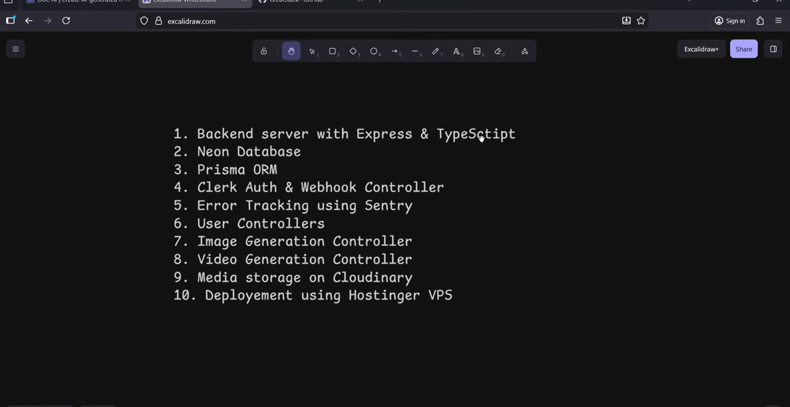

# 🎬 UGC AI — Backend (In Progress)

This repository contains the **backend architecture** for **UGC AI**, a scalable AI-powered platform for generating images and videos with authentication, credits, and plans.

The backend is being built with **production-grade tools** focusing on performance, security, and scalability.

---

## 🚀 Backend Tech Stack

- **Node.js + Express**
- **TypeScript**
- **Neon (Serverless PostgreSQL)**
- **Prisma ORM**
- **Clerk Authentication**
- **Cloudinary (Media Storage)**
- **Sentry (Error Tracking)**
- **Hostinger VPS (Deployment)**

---

## 🧱 Backend Architecture Roadmap

Below is the planned backend structure and implementation flow:

### Planned Modules

1. Backend server using **Express & TypeScript**
2. **Neon Database** (Serverless PostgreSQL)
3. **Prisma ORM** for database access
4. **Clerk Authentication & Webhook Controller**
5. Error tracking using **Sentry**
6. User Controllers
7. Image Generation Controller
8. Video Generation Controller
9. Media storage using **Cloudinary**
10. Deployment using **Hostinger VPS**

---

## 🔐 Authentication

- Secure authentication handled by **Clerk**
- Webhooks to sync users with the database
- Role & credit-based access control

---

## 🗄️ Database

- **Neon** for scalable PostgreSQL
- **Prisma ORM** for:
  - Type-safe queries
  - Easy migrations
  - Clean schema management

---

## 📦 Media Storage

- Images & videos stored securely using **Cloudinary**
- Optimized delivery with CDN support

---

## 📊 Error Monitoring

- **Sentry** integrated for:
  - Runtime error tracking
  - API crash monitoring
  - Production debugging

---

## 📌 Current Status

✅ Backend planning completed  
🚧 Express + TypeScript server setup  
🚧 Prisma + Neon integration  
🚧 Auth & generation controllers

---

## 👨‍💻 Author

**Tanish Gupta**  
Full-Stack AI Developer | SaaS Builder

---

## 📜 License

MIT License
