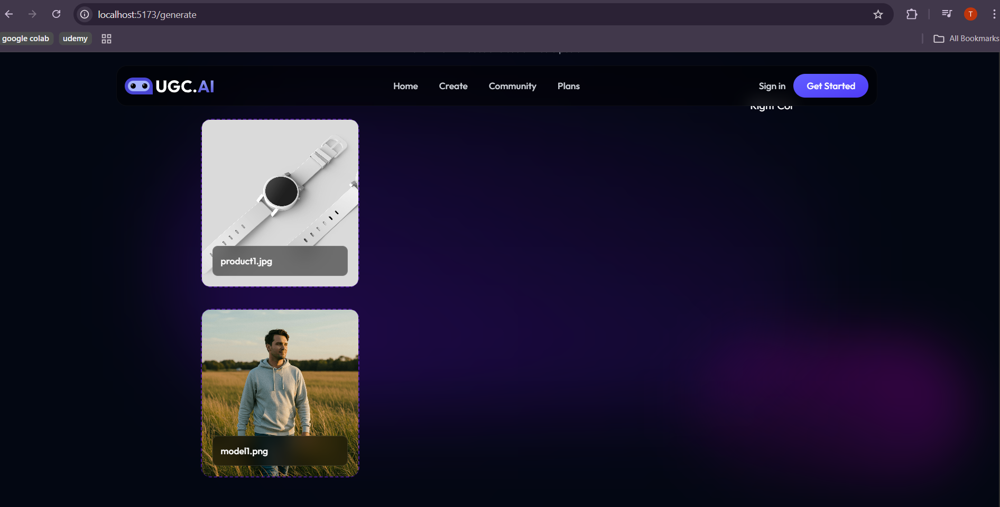

### 🎥 UGC AI – Create AI Generated Video Images

## 🚀 Project Overview

UGC AI is a Full-Stack AI SaaS application that enables users to generate AI-powered short promotional videos and ad creatives using product images, model images, and text prompts.

The platform is designed for:

Marketing teams

Content creators

Startups & brands

Social media ads (Instagram, YouTube Shorts, Reels)

## 🎯 Current Status

## 🚧 Frontend Phase 1 – In Progress

The project is being developed step-by-step, with each milestone committed to GitHub to demonstrate real-world development practices.

## ✨ Features Implemented (So Far)

# ✅ Frontend – Phase 1

Modern SaaS-style UI

Navigation bar with branding (UGC.AI)

Dedicated Generate page

Drag-and-drop image upload

Product image upload

Model/person image upload

Visual preview of uploaded images

Responsive & clean dark-themed UI

Prepared UI foundation for AI processing in next phases

## 🖼️ Frontend Preview (Current Progress)

Drag-and-drop interface for uploading **product** and **model** images.  
This UI will be used in upcoming phases for AI-powered video generation.

## 🛠️ Tech Stack

Frontend

React (Vite)

JavaScript (ES6+)

HTML5

CSS3 / Tailwind CSS

Drag & Drop APIs

Backend (Upcoming)

Node.js

Express.js

PostgreSQL

Gemini AI API

## 📁 Project Structure

UGC-AI-Create-AI-generated-video-images/
│
├── frontend/
│ ├── src/
│ │ ├── components/
│ │ ├── pages/
│ │ ├── assets/
│ │ └── App.jsx
│
├── backend/ # coming soon
│
├── screenshots/
│ └── frontend-drag-drop.png
│
├── .gitignore
└── README.md

## 🎯 Learning Objectives

Build real-world SaaS UI

Implement drag-and-drop UX

Prepare frontend for AI pipelines

Follow professional GitHub workflow

Showcase phased development to recruiters

## 🚀 Next Planned Features

Backend API integration

AI prompt handling

Image-to-video generation

User authentication

Cloud deployment (Netlify + Render)

## 👨‍💻 Author

Tanish Gupta
AI | Full Stack | SaaS | Machine Learning
📌 Building AI-powered products for real-world use cases
