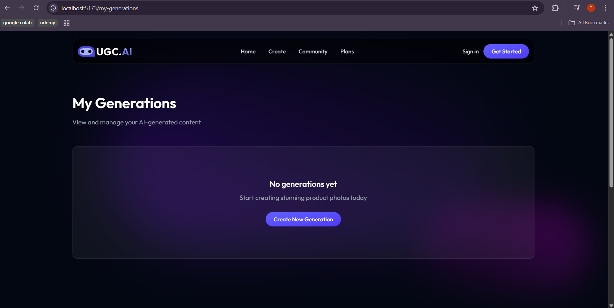
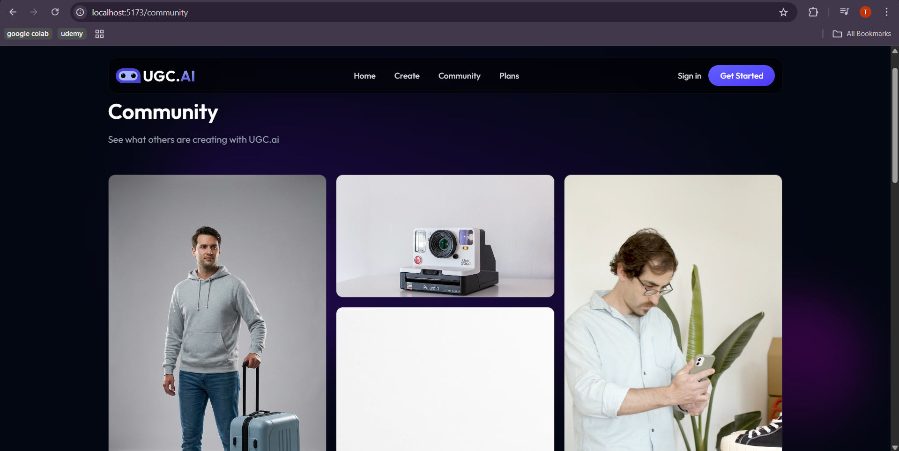

# 🎥 UGC AI – Create AI Generated Video & Images

## 🚀 Project Overview

**UGC AI** is a Full-Stack AI SaaS platform that enables users to generate **AI-powered short promotional videos and ad creatives** using product images, model images, and natural-language prompts.

The platform is being built step-by-step with real-world SaaS architecture and clean UI/UX practices, focusing on **creator-first design** and **scalable AI workflows**.

### Built for:

- 📢 Marketing teams
- 🎨 Content creators
- 🚀 Startups & brands
- 📱 Social media ads (Instagram Reels, YouTube Shorts, TikTok)

---

## 🎯 Current Status

### 🚧 Frontend Phase – In Progress

This repository currently focuses on **Frontend development**, with backend and AI pipelines planned for upcoming phases.  
Each milestone is committed separately to demonstrate **professional GitHub workflow**.

---

## ✨ Features Implemented (So Far)

### 🖼️ Generator UI – Phase 2

- Project name input
- Product name input
- Product description (optional)
- Aspect ratio selection (9:16 / 16:9)
- User prompt input (optional)
- Improved layout and alignment
- Hover-based video preview
- Generation status badges

---

## 🌍 Community Page

A public gallery showcasing AI-generated content created by users.

**Features**

- Masonry-style layout
- Image & video hover previews
- Community-focused browsing experience

---

## 🧑‍💻 My Generations Page

A personal dashboard for users to manage their AI-generated content.

**Features**

- Empty-state UX
- Call-to-action for new generation
- Designed for future controls (edit, delete, publish)

---

## 🛠️ Tech Stack

### Frontend

- React (Vite)
- TypeScript
- Tailwind CSS
- Lucide Icons
- Framer Motion
- Responsive UI design

### Backend (Upcoming)

- Node.js
- Express.js
- PostgreSQL
- AI APIs (Gemini / Image-to-Video models)
- Authentication & authorization

---

## 📁 Project Structure

UGC-AI-Create-AI-generated-video-images/
│
├── frontend/
│ ├── src/
│ │ ├── components/
│ │ ├── pages/
│ │ ├── assets/
│ │ ├── types/
│ │ └── App.tsx
│
├── backend/ # Coming soon
│
├── screenshots/
│ ├── frontend-generator-phase-2.png
│ ├── community-page.png
│ └── my-generations-page.png
│
├── .gitignore
└── README.md

---

## 🎯 Learning Objectives

- Build a real-world SaaS frontend
- Implement scalable UI components
- Design AI-ready workflows
- Practice clean GitHub commits
- Showcase phased development to recruiters

---

## 🚀 Next Planned Features

- Backend API integration
- AI prompt handling
- Image-to-video generation
- User authentication
- Publish to Community
- Cloud deployment (Netlify + Render)

---

## 👨‍💻 Author

**Tanish Gupta**  
AI | Full-Stack | SaaS | Machine Learning

📌 Building AI-powered products for real-world use cases  
🔗 GitHub: https://github.com/OfficialTanishGupta
