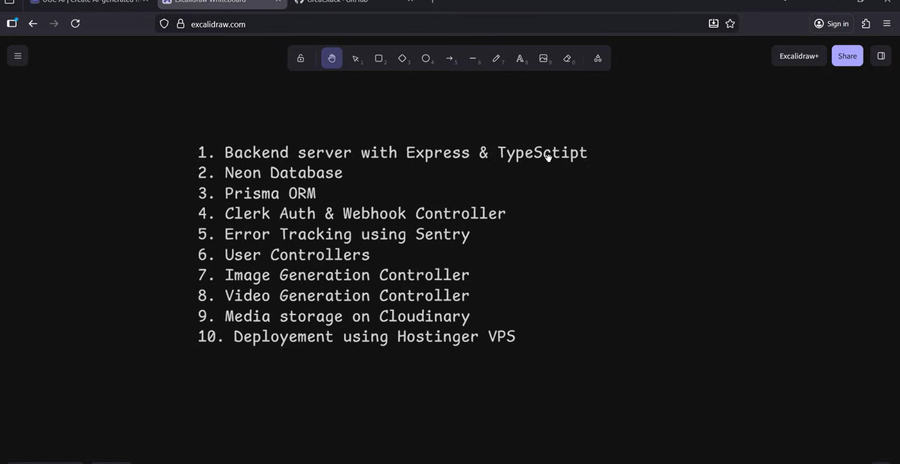
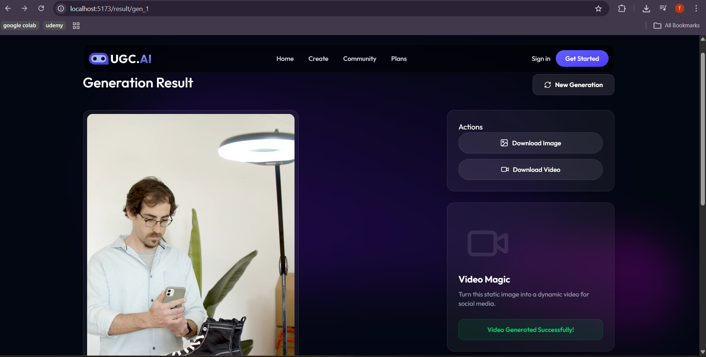

🚀 UGC AI — Create AI Generated Images & Videos

UGC AI is a Full-Stack AI SaaS platform that allows users to generate AI-powered images and videos using modern cloud infrastructure and scalable backend architecture.

The platform includes authentication, credit-based usage, media storage, and AI generation APIs, making it a foundation for building a production-ready AI SaaS product.

🌐 Project Demo


✨ Features

✅ AI Image Generation
✅ AI Video Generation
✅ Secure Authentication
✅ Credit-based usage system
✅ Media storage & CDN delivery
✅ Error monitoring
✅ Scalable cloud database
✅ Production-ready backend architecture

🧠 Tech Stack
Frontend

React

TypeScript

TailwindCSS

Backend

Node.js

Express.js

TypeScript

Database

Neon Serverless PostgreSQL

Prisma ORM

Authentication

Clerk Authentication

Media Storage

Cloudinary

Monitoring

Sentry

Deployment

Hostinger VPS

🏗️ System Architecture




The backend architecture is designed to be scalable and modular, enabling efficient handling of user authentication, AI generation pipelines, and media storage.

⚙️ Backend Modules

1️⃣ Express + TypeScript Server

Handles API routing, middleware, and application logic.

2️⃣ Authentication System

Authentication is handled by Clerk.

Features include:

Secure login & signup

Webhook-based user synchronization

Role & credit-based access

3️⃣ Database Layer

Neon Serverless PostgreSQL + Prisma ORM

Benefits:

Type-safe queries

Easy schema migrations

High scalability

Clean data models

4️⃣ AI Generation Controllers

Controllers handle:

Image generation requests

Video generation requests

Credit deduction

Generation history

5️⃣ Media Storage

Generated content is stored using Cloudinary.

Benefits:

CDN delivery

Media optimization

Secure storage

Fast global access

6️⃣ Error Monitoring

Integrated with Sentry to track:

Server crashes

Runtime errors

API failures

Production debugging

```text
📂 Project Structure
UGC-AI-Create-AI-generated-video-images

├── backend
│   ├── controllers
│   │   ├── image.controller.ts
│   │   ├── video.controller.ts
│   │   └── user.controller.ts
│   │
│   ├── routes
│   │   ├── image.routes.ts
│   │   ├── video.routes.ts
│   │   └── user.routes.ts
│   │
│   ├── prisma
│   │   └── schema.prisma
│   │
│   ├── middleware
│   │   └── auth.middleware.ts
│   │
│   └── server.ts
│
├── frontend
│
├── screenshots
│   ├── backend-roadmap.png
│   ├── dashboard.png
│   └── generation-page.png
│
└── README.md
```

🖼️ Screenshots

Product 1 which i used:

Model 1 which, I used:


Video Generation

🔐 Authentication Flow

1️⃣ User signs in using Clerk Authentication
2️⃣ Clerk sends webhook to backend
3️⃣ Backend stores user in Neon PostgreSQL
4️⃣ Credits assigned to user
5️⃣ User can generate AI images/videos

📊 Credit System

Each generation consumes credits.

Example:

Feature	Credits
Image Generation	4
Video Generation	5

This allows easy integration of SaaS pricing plans.

🚀 Deployment

The backend is deployed using Hostinger VPS.

Deployment stack:

Node.js server

PM2 process manager

Nginx reverse proxy


👨‍💻 Author

Tanish Gupta

AI/ML Developer | Full-Stack Developer | SaaS Builder

GitHub
https://github.com/OfficialTanishGupta

📜 License

MIT License

⭐ If you like this project

Consider giving the repository a star ⭐ on GitHub.
